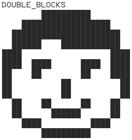
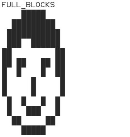
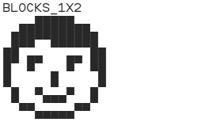
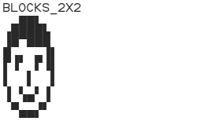
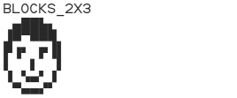
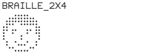

# pseudographics

A simple Python module for converting black-and-white bitmaps (contained in a 2D Numpy array) into pseudographics.


## Usage

```python
import numpy as np
from pseudographics import to_pseudographics, BlockSet

bitmap = np.array([
    [0, 1, 1, 0],
    [1, 0, 1, 1],
    [1, 1, 0, 1],
    [0, 1, 1, 0],
])

text_lines = to_pseudographics(bitmap, BlockSet.BLOCKS_1X2)

print('\n'.join(text_lines))
```

## API

- ```python
  def to_pseudographics(bitmap: np.ndarray, block_set: BlockSet) -> list[str])
  ```
  Converts a black-and-white bitmap into lines of pseudographic characters.
  
  `bitmap` is a 2D Numpy array containing the bitmap. Zero-value pixels are considered background, non-zero ones are considered foreground.

  `block_set` specifies which Unicode characters to use.

  Returns a list of text lines of the same length.

- ```python
  class BlockSet
  ```
  Enum specifying which pseudographic Unicode characters to use to represent bitmap pixels:

  - `DOUBLE_BLOCKS`
    Uses spaces and full-block characters from the <i>Block Elements</i> Unicode range.
    Each pixel of the bitmap is represented by two consecutive characters.
    In most monospaced fonts, the pixels look almost square.
    
    
    
  - `FULL_BLOCKS`
    Uses spaces and full-block characters from the <i>Block Elements</i> Unicode range.
    Each character represents one pixel of the bitmap.
    In most monospaced fonts, the pixels look stretched vertically.
    
    
    
  - `BLOCKS_1X2`
    Uses spaces and half-block characters from the <i>Block Elements</i> Unicode range.
    Each character represents two vertically arranged pixels of the bitmap.
    In most monospaced fonts, the pixels look almost square.
    
    
    
  - `BLOCKS_2X2`
    Uses spaces and quarter-block characters from the <i>Block Elements</i> Unicode range.
    Each character represents a 2×2 pixel chunk of the bitmap.
    In most monospaced fonts, the pixels look stretched vertically.
    
    
    
  - `BLOCKS_2X3`
    Uses sextant characters from the <i>Symbols for Legacy Computing</i> Unicode range along with <i>Block Elements</i> characters and spaces (introduced in Unicode 13 (2020), require newer fonts).
    Each character represents a 2×3 pixel chunk of the bitmap.
    In most monospaced fonts, the pixels look a bit stretched vertically.
    
    
    
  - `BLOCKS_2X4`
    Uses octant characters from the <i>Symbols for Legacy Computing Supplement</i> Unicode range along with <i>Block Elements</i> characters and spaces (introduced in Unicode 16 (2024), require the newest fonts).
    Each character represents a 2×4 pixel chunk of the bitmap.
    In most monospaced fonts, the pixels look almost square.
    
    
    
  - `BRAILLE_2X4`
    Uses characters from the <i>Braille Patterns</i> Unicode range.
    Each character represents a 2×4 pixel chunk of the bitmap.
    The pixels are usually round in shape with gaps in between.
    In some fonts, blank pixels are shown as empty circles.
    
    
